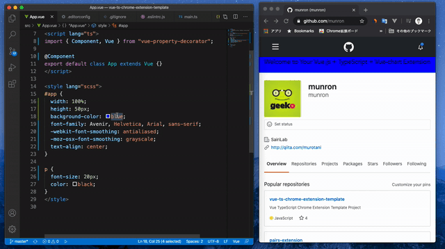

# mv2-vue-chrome-extension-template

modern chrome-extension development example  
ManifestV2 & Vue & TypeScript & Hot-Reload  

→ Manifest V3[https://github.com/munron/mv3-vue-chrome-extension-template](https://github.com/munron/mv3-vue-chrome-extension-template)



## Project setup
```
npm install
```


### Compiles and hot-reloads for development
```
npm run dev
```
drop dist folder to chrome://extension   
open [github](https://github.com/)

### Compiles and minifies for production
```
npm run build
```

### Lints and fixes files
```
npm run lint
```

### Customize configuration
See [Configuration Reference](https://cli.vuejs.org/config/).
